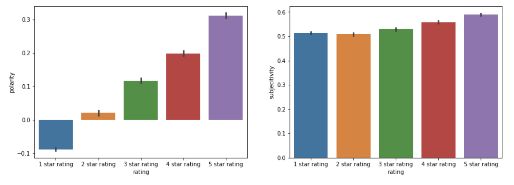

# Text_Analysis_Yelp_Comments

## Contributor
#### Jackie, Sheng, Yang  

## Introduction
#### Does star rating system on yelp give people a good idea of the overall restaurant? More specifically, when two people give 1 star rating on a specific business, does the level of discretion for tose two people towards the business mean the same?   

#### We conducted a text analysis on about 19,000 Panda Express yelp reviews. We performed two tasks, first, we created a model to predict whether reviews are positive, neutral or negative (1,2 stars are negative reviews, 3 stars are neutral reviews, and 4, 5 stars are positive reviews). Second, using Textblob to calculate the sentiment of each reviews and summarize the relationship between the sentiment and the original star rating for each reviews.   

## Method
* Randomly scrape 1500 panda express store reviews alone with the rating for each review. 
* Transform the rating of each reviews into three categories  (i.e., negative, neutral and positive).
* Perform machine learning and deep learning algorithms to predict reviews.
* Calculate the sentiment of each reviews.   

## Packages
* Pyspark
* Scikit learn
* Splinter
* Yelp- API
* Textblob
* Flask-App  

## Modeling
* NaiveBayes
* Neural network
* Random Forest
* Xgboost  

## Results
### Neural network performs the best when predicting the output of each reivew.
### Neural netword is high likely to get overfit...so we have to stop around 2, 3 epochs. 
 

### The sentiment of each review positively correlated to star ratings
 

